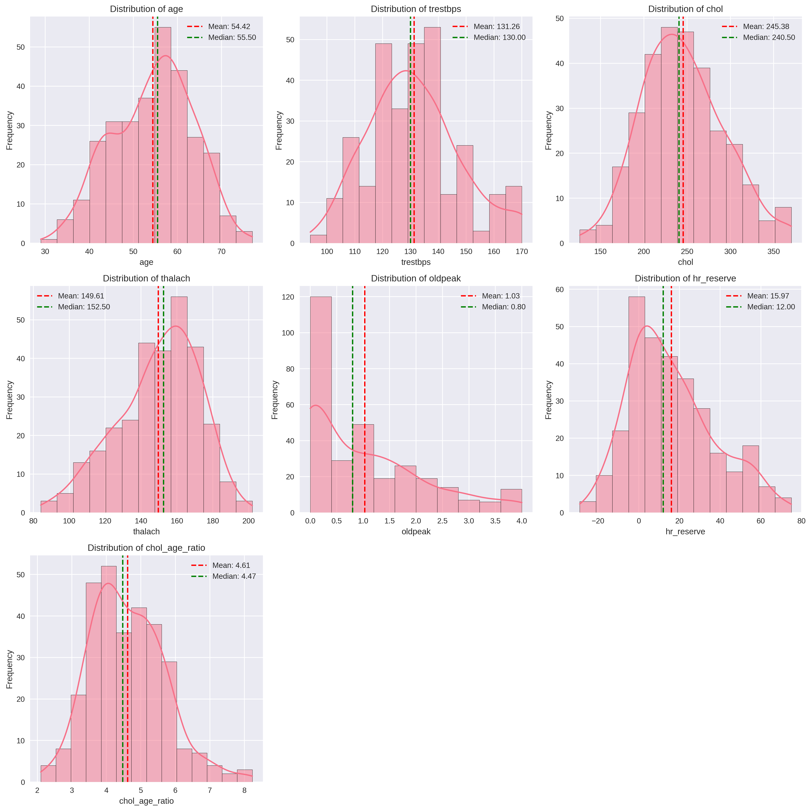
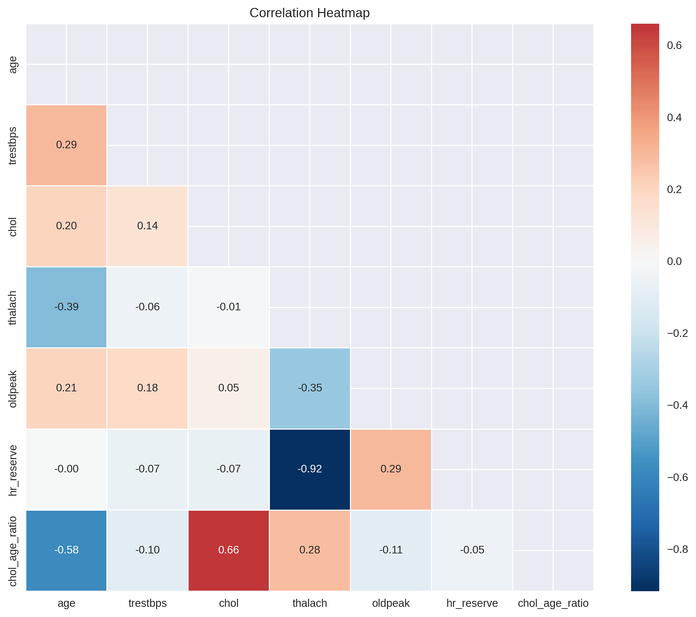
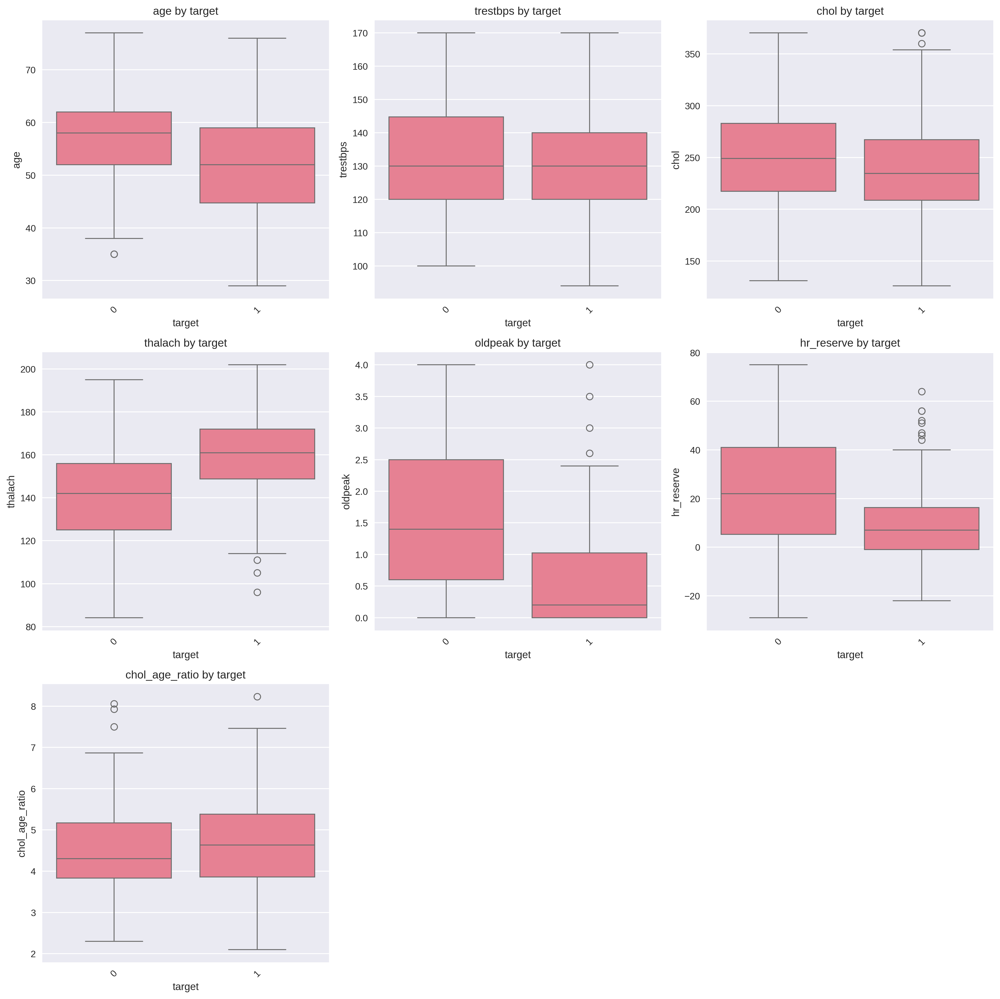

# Week 1 Report: Data Acquisition & Exploration

## Team: Statistics Superstars
**Date:** September 7, 2026

---

## 1. Dataset Overview

### Selected Dataset: Heart Disease

**Source:** UCI Machine Learning Repository (https://archive.ics.uci.edu/dataset/45/heart+disease), distributed as `heart.csv` (the widely-used 1,025-row Kaggle version of the processed Cleveland data).

**Description:**
The Heart Disease dataset contains 14 clinical variables recorded for patients evaluated for heart disease, including demographic data (age, sex), resting and exercise-test measurements (resting blood pressure, cholesterol, maximum heart rate, ST depression), and a binary `target` column indicating whether heart disease was diagnosed (1) or not (0). After cleaning, we added two derived columns (`hr_reserve` and `chol_age_ratio`) and removed 723 duplicate rows.

**Shape:** 302 rows x 16 columns (post-cleaning)

**Variables:**

| Variable | Type | Description | Missing (%) |
|----------|------|-------------|-------------|
| age | numeric | Age of the patient in years | 0% |
| target | categorical | Heart disease diagnosis (1 = present, 0 = absent) - prediction target | 0% |
| sex | categorical | Sex (1 = male, 0 = female) | 0% |
| cp | categorical | Chest pain type (0-3) | 0% |
| trestbps | numeric | Resting blood pressure (mm Hg) | 0% |
| chol | numeric | Serum cholesterol (mg/dl) | 0% |
| fbs | categorical | Fasting blood sugar > 120 mg/dl (1 = true, 0 = false) | 0% |
| restecg | categorical | Resting electrocardiographic results (0-2) | 0% |
| thalach | numeric | Maximum heart rate achieved | 0% |
| exang | categorical | Exercise-induced angina (1 = yes, 0 = no) | 0% |
| oldpeak | numeric | ST depression induced by exercise relative to rest | 0% |
| slope | categorical | Slope of the peak exercise ST segment (0-2) | 0% |
| ca | categorical | Number of major vessels (0-4) colored by fluoroscopy | 0% |
| thal | categorical | Thalassemia result (0-3) | 0% |
| hr_reserve | numeric (derived) | (220 - age) - thalach: estimated heart rate reserve | 0% |
| chol_age_ratio | numeric (derived) | chol / age | 0% |

Full column descriptions are in `reports/data_dictionary.csv`.

---

## 2. Data Cleaning Summary

### Steps Performed:
1. **Missing Values**: No missing values were found in the raw dataset.
2. **Duplicates**: 723 duplicate rows removed (of 1,025 total) - see Data Quality Issues below.
3. **Data Types**: `target`, `sex`, `cp`, `fbs`, `restecg`, `exang`, `slope`, `ca`, and `thal` converted to categorical (each has fewer than 10 unique values).
4. **Outliers**: 20 outliers detected and capped (IQR method) across `trestbps` (9), `chol` (5), `thalach` (1), and `oldpeak` (5).
5. **Derived Columns**: Added `hr_reserve` (estimated max heart rate [220-age] minus achieved max heart rate) and `chol_age_ratio` (cholesterol relative to age).

**See:** `reports/cleaning_log.txt` for detailed cleaning actions

---

## 3. Statistical Findings

### Key Summary Statistics (numeric variables):

| Variable | Mean | Median | Std | Skew | Kurtosis |
|----------|------|--------|-----|------|----------|
| age | 54.42 | 55.50 | 9.05 | -0.20 | -0.53 |
| trestbps | 131.26 | 130.00 | 16.61 | 0.39 | -0.16 |
| chol | 245.38 | 240.50 | 47.49 | 0.34 | -0.09 |
| thalach | 149.61 | 152.50 | 22.77 | -0.49 | -0.24 |
| oldpeak | 1.03 | 0.80 | 1.11 | 0.99 | 0.12 |
| hr_reserve | 15.97 | 12.00 | 20.92 | 0.62 | -0.19 |
| chol_age_ratio | 4.61 | 4.47 | 1.07 | 0.52 | 0.39 |

### Normality Tests (Shapiro-Wilk):

| Variable | P-value | Normal? |
|----------|---------|---------|
| age | 0.0067 | No |
| trestbps | 3.04e-05 | No |
| chol | 0.0188 | No |
| thalach | 8.67e-05 | No |
| oldpeak | 2.64e-16 | No |
| hr_reserve | 4.12e-07 | No |
| chol_age_ratio | 6.50e-04 | No |

None of the seven continuous variables are normally distributed at alpha = 0.05.

### Strongest Correlations:

1. thalach <-> hr_reserve: -0.918 (Very strong negative - expected, since `hr_reserve` is derived from `thalach`)
2. chol <-> chol_age_ratio: 0.659 (Strong positive - expected, since `chol_age_ratio` is derived from `chol`)
3. age <-> chol_age_ratio: -0.584 (Moderate negative)
4. age <-> thalach: -0.395 (Moderate negative - max heart rate declines with age)
5. thalach <-> oldpeak: -0.349 (Moderate negative)

### Diagnosis Group Comparison (target: 0 = no disease, 164 with disease / 138 without):

| Variable | No disease (target=0) | Disease (target=1) |
|----------|------------------------|---------------------|
| age | 56.60 | 52.59 |
| trestbps | 133.79 | 129.13 |
| chol | 250.54 | 241.03 |
| thalach | 139.20 | 158.38 |
| oldpeak | 1.55 | 0.59 |

---

## 4. Key Visualizations

### Figure 1: Distribution Plots

### Figure 2: Correlation Heatmap

### Figure 3: Box Plots (by diagnosis)

### Figure 4: Interactive 3D Scatter (age, trestbps, chol; colored by diagnosis)
`figures/3d_scatter.html`

---

## 5. Initial Insights

1. **Key Finding 1**: Patients diagnosed with heart disease in this sample achieved a notably higher maximum heart rate during exercise testing (158.4 bpm vs. 139.2 bpm) and had much lower ST depression (`oldpeak`: 0.59 vs. 1.55) than patients without a diagnosis. This lines up with the two strongest raw-variable correlations with `thalach` and `oldpeak` seen in the boxplots and matches known clinical associations for exercise-stress testing.
2. **Key Finding 2**: The two strongest correlations in the dataset (`thalach`<->`hr_reserve` and `chol`<->`chol_age_ratio`) are largely mechanical, since both derived columns are built directly from `thalach`/`age` and `chol`/`age`. Excluding those, the next-strongest relationships are all modest (|r| < 0.6): older patients tend to have a lower `chol_age_ratio` and a lower maximum heart rate, and lower maximum heart rate tends to go with higher ST depression.
3. **Key Finding 3**: None of the seven continuous variables are normally distributed (all Shapiro-Wilk p-values are well below 0.05). Week 2 hypothesis testing should therefore favor non-parametric methods (e.g., Mann-Whitney U for comparing `thalach`/`oldpeak` between diagnosis groups, Spearman correlation for continuous relationships) over t-tests/Pearson-based inference.

---

## 6. Data Quality Issues

### Problems Identified:
- **Heavy duplication**: 723 of the original 1,025 rows (about 70%) were exact duplicates. This is a known characteristic of this particular CSV distribution, which repeats the original 303-instance Cleveland dataset. All analysis in this report uses the de-duplicated 302-row dataset.
- **Encoded categorical variables**: `sex`, `cp`, `fbs`, `restecg`, `exang`, `slope`, `ca`, `thal`, and `target` are stored as small integer codes. We restore their categorical dtype at the start of each downstream notebook, since it is not preserved by a plain CSV round-trip - see the note at the top of `02_statistical_summary.ipynb` and `03_exploratory_visualizations.ipynb`.
- None of the continuous variables are normally distributed (see Section 3), so non-parametric tests are recommended for Week 2.

### Recommendations:
- Confirm with the data source whether the duplicate rows represent a data export issue or intentional oversampling before using the full 1,025-row version for any modeling task.
- Use non-parametric statistical tests (Mann-Whitney U, Kruskal-Wallis, Spearman correlation) for Week 2 hypothesis testing given the non-normal distributions.

---

## 7. Team Contributions

| Team Member | Tasks Completed | Hours |
|-------------|-----------------|-------|
| Student A (Prompiriya Traijit) | GitHub setup, data cleaning, documentation | 6 |
| Student B (Min Thaw Chan) | Statistical analysis, normality tests | 5 |
| Student C (Aung Kyaw Phyo) | Visualizations, interactive plots | 5 |

---

## 8. Next Steps (Week 2)

- [ ] Hypothesis testing (e.g., Mann-Whitney U on `thalach` and `oldpeak` by diagnosis group)
- [ ] Confidence intervals for group means
- [ ] Distribution fitting
- [ ] Bootstrap methods

---

## Appendix

**Files:**
- `data/processed/cleaned_data.csv`
- `reports/data_dictionary.csv`
- `reports/summary_statistics.csv`
- `reports/normality_tests.csv`
- `reports/pearson_correlation.csv`
- `reports/spearman_correlation.csv`
- `reports/cleaning_log.txt`
- `reports/figures/*.png`, `reports/figures/3d_scatter.html`

**Notebooks:**
- `notebooks/00_initial_inspection.ipynb`
- `notebooks/01_data_cleaning.ipynb`
- `notebooks/02_statistical_summary.ipynb`
- `notebooks/03_exploratory_visualizations.ipynb`
