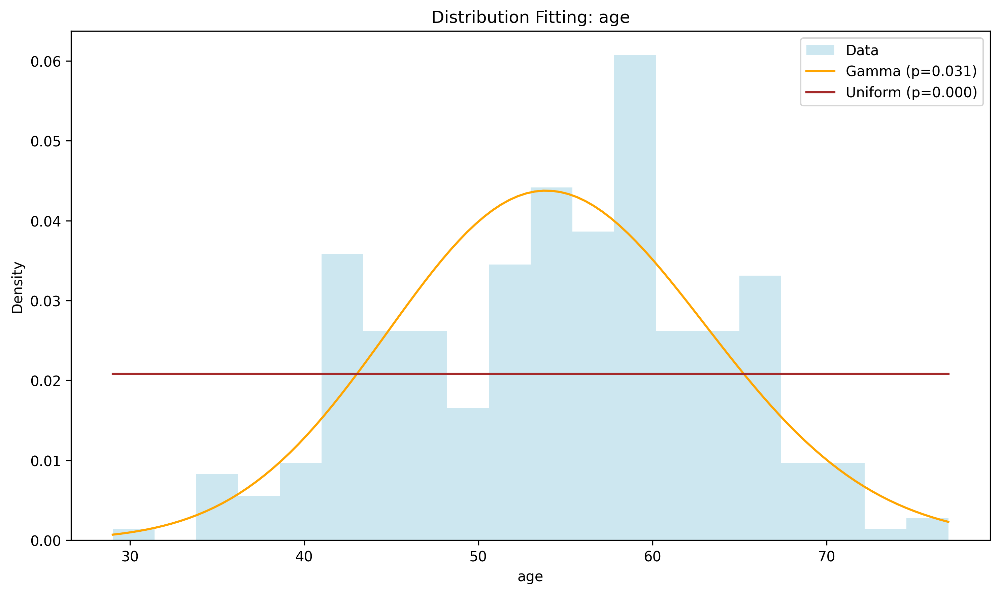
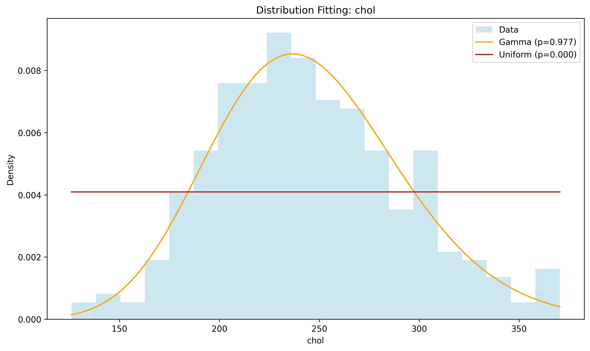
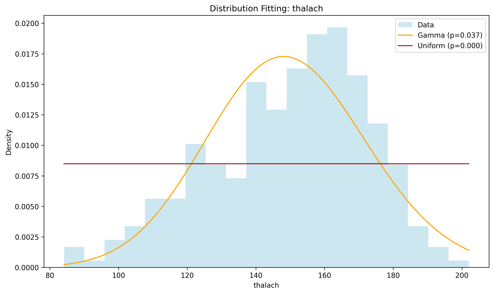
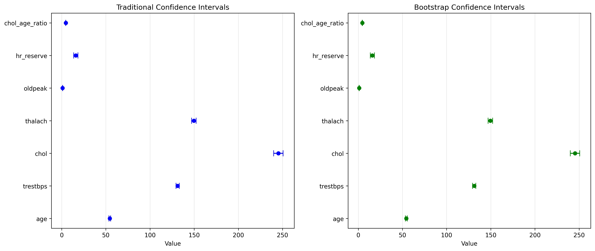

# Week 2 Report: Statistical Analysis

## Team: Statistics Superstars
**Date:** September 14, 2026

---

## 1. Hypothesis Testing Results

### 1.1 T-Tests

| Test | Variable 1 | Variable 2 | t-statistic | p-value | Significant |
|------|-----------|-----------|-------------|---------|-------------|
| One-sample | chol | 200 (clinical threshold) | 16.606 | < 0.0001 | Yes |
| Independent | thalach | target (0 vs 1) | -7.922 | < 0.0001 | Yes |
| Independent | oldpeak | target (0 vs 1) | 8.071 | < 0.0001 | Yes |

**Interpretation:**
- The average cholesterol in our sample (245.4 mg/dl) is significantly higher than the clinical "borderline high" threshold of 200 mg/dl. Most patients in this dataset carry elevated cholesterol.
- Patients diagnosed with heart disease have a significantly **higher** maximum heart rate during exercise (158.4 bpm) than patients without a diagnosis (139.2 bpm).
- Patients diagnosed with heart disease have a significantly **lower** ST depression score (0.59) than patients without a diagnosis (1.55).
- Together, these confirm the pattern we first noticed in the Week 1 boxplots: `thalach` and `oldpeak` are the two variables that separate the two diagnosis groups most clearly.

### 1.2 ANOVA

| Variable | Groups | F-statistic | p-value | Significant |
|----------|--------|-------------|---------|-------------|
| thalach | cp (4 chest pain types) | 17.663 | < 0.0001 | Yes |
| chol | cp (4 chest pain types) | 0.806 | 0.491 | No |

**Interpretation:**
- Maximum heart rate differs significantly across the four chest pain types. At least one chest pain type has a notably different average maximum heart rate than the others.
- Cholesterol does **not** differ significantly across chest pain types - chest pain type tells us little about a patient's cholesterol level on its own.
- Post-hoc analysis (e.g. Tukey's HSD) would be needed to say exactly which chest pain types differ on `thalach`; that's a good candidate for Week 3 follow-up.

### 1.3 Chi-Square Test

| Variable 1 | Variable 2 | chi2-statistic | p-value | Significant |
|-----------|-----------|-----------------|---------|-------------|
| target | sex | 23.084 | < 0.0001 | Yes |
| target | exang | 55.456 | < 0.0001 | Yes |

**Interpretation:**
- Heart disease diagnosis (`target`) is **not independent** of sex - the two are statistically associated in this sample.
- Heart disease diagnosis is also **not independent** of exercise-induced angina (`exang`) - patients who experience angina during exercise are much more likely to also carry a heart disease diagnosis. This is the strongest association we found among the categorical variables.

---

## 2. Distribution Fitting

### 2.1 Best-Fitting Distributions

| Column | Best Fit | p-value | Good Fit? |
|--------|----------|---------|-----------|
| age | Gamma | 0.031 | No |
| trestbps | Gamma | 0.155 | Yes |
| chol | Gamma | 0.977 | Yes |
| thalach | Gamma | 0.037 | No |
| oldpeak | Uniform | ~0.000 | No |
| hr_reserve | Gamma | 0.387 | Yes |
| chol_age_ratio | Gamma | 0.794 | Yes |

### 2.2 Distribution Visualizations

**Interpretation:**
- Cholesterol (`chol`) is very well described by a Gamma distribution (p = 0.977) - a classic shape for a positive, right-skewed biological measurement.
- `trestbps`, `hr_reserve`, and `chol_age_ratio` are also reasonably well described by a Gamma distribution.
- `age`, `thalach`, and `oldpeak` are not well fit by any of the five candidate distributions we tried. `age` and `thalach` are left-skewed rather than right-skewed (the opposite direction the Gamma/Lognormal/Exponential family typically fits well), and `oldpeak` has a large spike of patients at exactly 0, which no smooth continuous distribution can reproduce.
- This matches the Week 1 finding that none of our numeric columns pass the Shapiro-Wilk normality test - so for anything sensitive to distribution shape, non-parametric methods remain the safer choice.

---

## 3. Confidence Intervals

### 3.1 Traditional Confidence Intervals (95%)

| Column | Mean | CI Lower | CI Upper | Width |
|--------|------|----------|----------|-------|
| age | 54.421 | 53.400 | 55.441 | 2.041 |
| trestbps | 131.258 | 129.385 | 133.131 | 3.746 |
| chol | 245.377 | 240.021 | 250.733 | 10.711 |
| thalach | 149.613 | 147.045 | 152.181 | 5.135 |
| oldpeak | 1.028 | 0.903 | 1.153 | 0.250 |
| hr_reserve | 15.966 | 13.608 | 18.325 | 4.718 |
| chol_age_ratio | 4.613 | 4.492 | 4.734 | 0.242 |

### 3.2 Bootstrap Confidence Intervals (95%, 10,000 resamples)

| Column | Mean | CI Lower | CI Upper | Width |
|--------|------|----------|----------|-------|
| age | 54.421 | 53.414 | 55.464 | 2.050 |
| trestbps | 131.258 | 129.411 | 133.123 | 3.712 |
| chol | 245.377 | 240.040 | 250.692 | 10.652 |
| thalach | 149.613 | 147.017 | 152.153 | 5.135 |
| oldpeak | 1.028 | 0.904 | 1.155 | 0.251 |
| hr_reserve | 15.966 | 13.619 | 18.301 | 4.682 |
| chol_age_ratio | 4.613 | 4.494 | 4.735 | 0.241 |

**Comparison:**
- The traditional (z-based, since n = 302 >= 30) and bootstrap confidence intervals are almost identical for every column, both in position and width (differences show up only in the second or third decimal place).
- This is expected: with a sample size of 302, the Central Limit Theorem already makes the sampling distribution of the mean close to normal, even for columns like `oldpeak` that are not normally distributed themselves. Bootstrap and traditional methods only tend to diverge noticeably at small sample sizes or with heavily skewed statistics (e.g. the median of a skewed variable).
- Given how closely they agree here, either method is defensible for reporting the mean; we used the traditional CI in the summary tables above for simplicity, and bootstrap as a robustness check.

---

## 4. Key Statistical Findings

1. **Normality**: 0 of our 7 numeric variables are normally distributed (confirmed in Week 1 with Shapiro-Wilk, and reinforced here - only `trestbps`, `chol`, `hr_reserve`, and `chol_age_ratio` pass a Gamma-distribution goodness-of-fit test; none pass as Normal).
2. **Significant Differences**: Found significant differences in maximum heart rate and ST depression between patients with and without heart disease, and a significant relationship between heart disease diagnosis and both sex and exercise-induced angina.
3. **Distribution**: The best-fitting distribution for most continuous clinical variables is Gamma, consistent with right-skewed biological measurements; `age`, `thalach`, and `oldpeak` don't fit any of the five candidate distributions well.
4. **Confidence**: We are 95% confident that the true average maximum heart rate for patients like those in this dataset lies between 147.0 and 152.2 bpm, and that true average cholesterol lies between 240.0 and 250.7 mg/dl.

---

## 5. Interpretation & Conclusions

### 5.1 What the Results Mean

- Heart disease diagnosis in this dataset is most strongly tied to how the heart responds during an exercise stress test - patients with disease reach a higher maximum heart rate but show less ST depression, and are far more likely to report exercise-induced angina.
- Resting measurements alone (blood pressure, cholesterol) are less clearly linked to diagnosis than exercise-test measurements are - cholesterol did not differ significantly across chest pain types, for example.
- Sex is significantly associated with diagnosis, so any Week 3 predictive work should check whether this reflects a real physiological difference or an artifact of how many male vs. female patients are in the sample (206 male vs. 96 female after cleaning).

### 5.2 Limitations

- Our cleaned sample has only 302 patients, all from the same original Cleveland dataset, so these findings may not generalize to other patient populations.
- None of the continuous variables are normally distributed, so the ANOVA and t-test results (which assume approximately normal data, or rely on the Central Limit Theorem for large samples) should be treated as a useful first pass rather than the final word - a Week 3 follow-up with non-parametric equivalents (Mann-Whitney U, Kruskal-Wallis) would be a good robustness check.
- Sex, chest pain type, and diagnosis are all associated with each other; we have not controlled for these overlapping relationships, so we can't yet say which variable is the true driver of any given association (a confounding risk).

### 5.3 Recommendations for Week 3

- Highlight the `thalach`/`oldpeak`-by-diagnosis comparison and the `target`-by-`exang` relationship, since these were our strongest and most interpretable findings.
- Consider a simple logistic regression or decision tree on `target` for a dashboard feature, using `thalach`, `oldpeak`, `exang`, and `cp` as predictors, since these showed the clearest statistical relationships this week.
- Add a non-parametric cross-check (Mann-Whitney U in place of the independent t-tests) given that none of our variables are normally distributed.

---

## 6. Team Contributions

| Team Member | Tasks Completed | Hours |
|-------------|-----------------|-------|
| Student A (Nyi Min Satt) | Repository updates, Week 2 report structure, environment checks | 2 |
| Student B (Lappawat Mahawong) | Statistics module, all hypothesis tests, distribution fitting, confidence intervals | 8 |
| Student C (ZONGTING LI) | Distribution and confidence interval visualizations | 3 |

---

## Appendix

**Files Generated:**
- `src/statistics.py`
- `reports/hypothesis_tests_summary.csv`
- `reports/distribution_fitting_summary.csv`
- `reports/ci_comparison.csv`
- `reports/figures/distribution_fit_age.png`, `distribution_fit_chol.png`, `distribution_fit_thalach.png`
- `reports/figures/confidence_intervals_comparison.png`
- `reports/week2_report.md`

**Notebooks:**
- `notebooks/04_hypothesis_testing.ipynb`
- `notebooks/05_distribution_fitting.ipynb`
- `notebooks/06_confidence_intervals.ipynb`

**Note on numbering:** the Week 2 guide's example code refers to these as notebooks `02`-`04`, but Week 1 already uses `02_statistical_summary.ipynb` and `03_exploratory_visualizations.ipynb` in this repo. Since this is one continuous project, we numbered the Week 2 notebooks `04`-`06` instead, so nothing from Week 1 gets overwritten and the whole sequence still runs in order.
